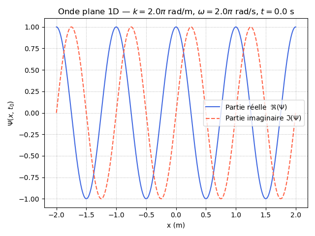
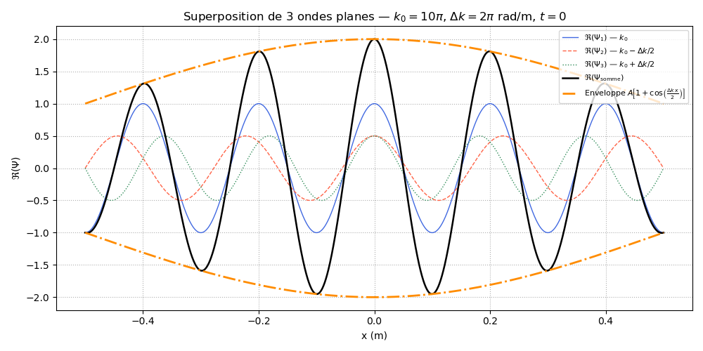
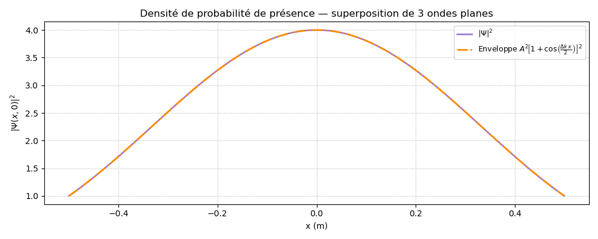

Le code Python a pour but de modéliser et visualiser une onde plane à une dimension (1D), puis d'étudier le phénomène d'interférence (battements) obtenu en superposant trois ondes planes de nombres d'onde légèrement différents. Cela permet d'illustrer la formation rudimentaire d'un "paquet d'ondes".

Le code est divisé en deux grandes parties (comme l'exercice). Voici le rôle détaillé de chaque fonction et de chaque variable :

### Partie 1 : Définition et représentation d'une onde plane simple
La fonction PlaneWave(amp, k, omega, x, t)
Cette fonction calcule la valeur d'une onde plane mathématique $\Psi(x, t) = A \cdot e^{i(kx - \omega t)}$.

**amp (ou $A$)** : L'amplitude de l'onde. Elle détermine la "hauteur" maximale de l'oscillation. 
**k**: Le nombre d'onde (en rad/m). Il est lié à la longueur d'onde spatiale $\lambda$ par la formule $k = \frac{2\pi}{\lambda}$. Il détermine la rapidité des oscillations dans l'espace. 
**omega (ou $\omega$)** : La pulsation angulaire (en rad/s). Elle est liée à la période temporelle $T$ par $\omega = \frac{2\pi}{T}$. Elle détermine la rapidité des oscillations dans le temps. 
**x** : La ou les positions spatiales (généralement un tableau numpy) où l'on évalue l'onde. 
**t** : L'instant (le temps) auquel on évalue l'onde.
Variables de test et de tracé (Figure 1) 
**amp, k, omega, t**: Des valeurs choisies arbitrairement pour tracer une première onde (ici, avec $\lambda = 1$ m, $T = 1$ s, à $t=0$). 
**x** : Un tableau de 1000 points entre $-2$ et $+2$ mètres, servant d'axe des abscisses. 
**psi** : Le résultat du calcul de la fonction PlaneWave. C'est un tableau de nombres complexes. 
**fig, ax** : Variables utilisées par matplotlib pour créer la figure et le système d'axes. Le code trace ensuite la partie réelle (en bleu) et imaginaire (en rouge pointillé) de l'onde plane. 

### Partie 2 : Superposition de trois ondes planes
Cette partie illustre comment additionner des ondes pour créer une figure de battement, précurseur d'un paquet d'ondes localisé.

Paramètres de la superposition 
**A** : L'amplitude de l'onde principale (centrale). 
**k0** : Le nombre d'onde de l'onde centrale (ici $10\pi$ rad/m). C'est la fréquence spatiale "porteuse". 
**dk (ou $\Delta k$)** : L'écart en nombre d'onde entre les ondes. Les deux autres ondes auront des nombres d'onde $k_0 - \Delta k/2$ et $k_0 + \Delta k/2$. 
**t2** : L'instant d'observation (ici $t=0$).
omega_1, omega_2, omega_3 : Les pulsations associées à chaque onde. Le code utilise une relation de dispersion arbitraire (simplifiée) $\omega \propto k^2$, typique d'une particule libre non relativiste ($\omega = \frac{\hbar k^2}{2m}$ avec $\frac{\hbar}{2m}$ pris égal à 1 pour simplifier). 
**x2** : Un nouvel axe spatial, centré autour de 0, avec des limites choisies spécifiquement pour voir exactement un "battement" complet ($[-\pi/\Delta k, \pi/\Delta k]$). 

### Les ondes et leur somme
**psi1** : L'onde plane centrale, d'amplitude $A$ et de nombre d'onde $k_0$. 
**psi2, psi3** : Deux ondes planes "satellites", de part et d'autre de $k_0$, d'amplitude moitié $A/2$. 
**psi_sum** : La somme des trois ondes (psi1 + psi2 + psi3). C'est le principe de superposition linéaire. 
**envelope** : Une formule mathématique analytique qui trace le "contour" de la somme des trois ondes. L'interférence de ces trois ondes crée un motif modulé par une fonction cosinus. 

### Tracés (Figures 2 et 3)
**Figure 2 (fig2, ax2) :** Trace les parties réelles des trois ondes individuellement, leur somme (en noir épais), et l'enveloppe théorique (en orange) qui encadre parfaitement la somme. 
**rho** : La densité de probabilité, calculée comme le module au carré de l'onde résultante ($|\Psi|^2$). En mécanique quantique, cela représente la probabilité de trouver la particule à la position $x$. 
**envelope_rho**: Le carré de l'enveloppe, pour encadrer la densité de probabilité. 

**Figure 3 (fig3, ax3)** : Trace cette densité de probabilité (rho) et son enveloppe. On voit qu'au lieu d'être uniforme dans l'espace (comme pour une onde plane unique), la probabilité présente des maxima et des minima : la particule commence à être "localisée" dans l'espace grâce à l'addition de différentes fréquences (principe d'incertitude d'Heisenberg).
