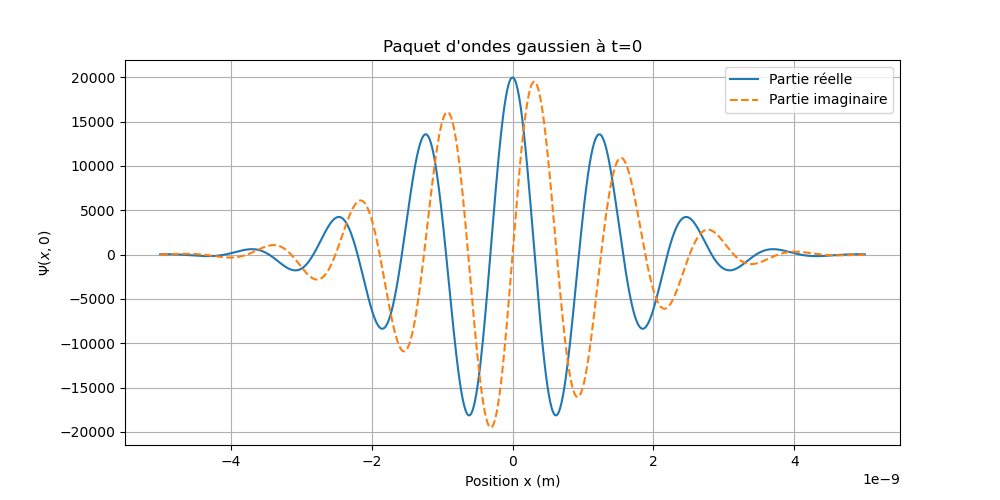

Le code Python a pour but de modéliser et visualiser un paquet d'ondes gaussien à une dimension (1D), qui est une représentation mathématique classique d'une particule en mécanique quantique (comme un électron libre).

Il définit mathématiquement la fonction d'onde $\Psi(x,t)$ d'un tel paquet, calcule ses valeurs pour différentes positions à un instant donné ($t=0$), puis trace les parties réelle et imaginaire de cette fonction d'onde à l'aide de la bibliothèque matplotlib.

Voici le rôle détaillé de chaque variable :

### Constantes physiques
**hbar** : La constante de Planck réduite ($\hbar=\frac{h}{2\pi}$). C'est la constante fondamentale de la mécanique quantique (en Joules par seconde, J·s). 
**m** : La masse de la particule modélisée. La valeur 9.109e-31 kg correspond à la masse d'un électron. 
Variables de la fonction GaussWP(k0, a, x, t)  
Cette fonction calcule l'amplitude de probabilité de trouver la particule à la position x au temps t.  
**k0** : Le vecteur d'onde moyen du paquet. Il est proportionnel à l'impulsion (la quantité de mouvement) moyenne de la particule ($p = \hbar k_0$). 
**a** : Un paramètre réel strictement positif qui définit la largeur initiale (à $t=0$) du paquet d'ondes dans l'espace. Plus a est grand, plus le paquet est large spatialement. 
**x** : La ou les positions (généralement un tableau numpy de coordonnées) où l'on souhaite évaluer la fonction d'onde. 
**t** : L'instant (le temps) auquel on évalue la fonction d'onde. 
**alpha** : Une variable intermédiaire complexe $\alpha(t) = a + i \frac{\hbar t}{2m}$. Elle traduit le fait que le paquet d'ondes s'étale (s'élargit) naturellement au cours du temps. 
**norm** : Le facteur de normalisation. Il assure que la probabilité totale de trouver la particule quelque part dans l'espace reste toujours égale à 1 (ou 100%). 
**vg** : La vitesse de groupe ($v_g = \frac{\hbar k_0}{m}$). C'est la vitesse classique à laquelle se déplace le centre du paquet d'ondes. 
**exp_term** : Le terme principal de l'équation. Il est composé de deux parties multipliées entre elles : 
Une partie réelle (l'enveloppe gaussienne) qui décrit la cloche de probabilité se déplaçant à la vitesse vg. 
Une partie imaginaire oscillante qui décrit la phase de l'onde quantique. 
### Variables de la section de test (représentation)
**x** : Un tableau généré par np.linspace contenant 1000 points répartis uniformément entre $-5$ nanomètres ($-5 \times 10^{-9}$ m) et $+5$ nanomètres. C'est l'axe des abscisses pour le graphique. 
**k0** : La valeur numérique choisie pour le vecteur d'onde ($5 \times 10^9$ $m^{-1}$). 
**a** : La valeur numérique choisie pour la largeur ($10^{-18}$ $m^2$). 
**psi_0** : Le résultat du calcul de la fonction d'onde GaussWP. C'est un tableau de nombres complexes contenant les valeurs de $\Psi(x, t=0)$ pour chaque position définie dans le tableau x. C'est ce qui est tracé sur le graphique. 

